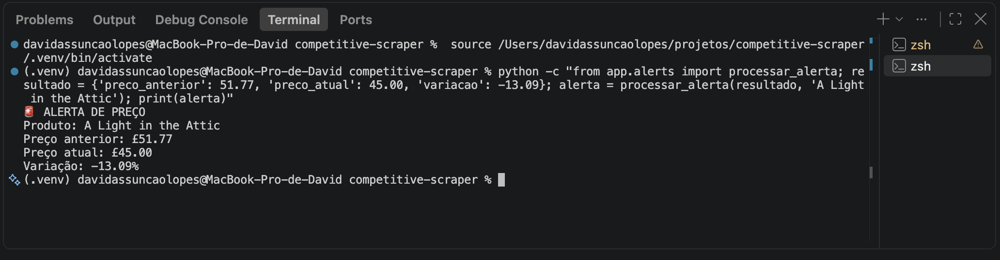
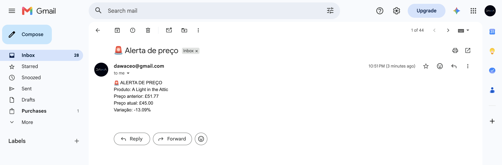

# 🕷️ Competitive Scraper

Sistema automatizado de monitoramento de preços de concorrentes, desenvolvido em Python. Ele coleta produtos de um site, guarda o histórico de preços em banco de dados, calcula as variações e envia um alerta (terminal e e-mail) quando o preço cai **10% ou mais**.




> **Sobre os dados:** o scraper usa o **Books to Scrape**, um site criado especificamente para praticar scraping. Não há concorrentes reais, e os preços do site não mudam. Por isso, a funcionalidade de alerta foi validada com **cenários controlados** de queda de preço. **[CONFIRMAR: os prints de alerta acima vêm desse cenário controlado]**

---

## 🎯 Pergunta de negócio

Como acompanhar os preços de produtos de um site ao longo do tempo e ser avisado automaticamente quando houver uma queda relevante?

---

## 🔄 Fluxo do sistema

```text
Website
   ↓
Selenium
   ↓
BeautifulSoup
   ↓
Extração dos produtos
   ↓
SQLite + SQLAlchemy
   ↓
Histórico de preços
   ↓
Comparação de preços
   ↓
Identificação da variação
   ↓
Alerta de preço
   ↓
E-mail
```

---

## 🚀 Funcionalidades

* Acesso automatizado ao site com Selenium
* Extração de nome, preço e URL dos produtos com BeautifulSoup
* Conversão e tratamento dos preços
* Persistência dos produtos em SQLite, com modelagem em SQLAlchemy
* Histórico de preços por produto
* Identificação do preço anterior e do atual, com cálculo percentual da variação
* Classificação da variação: alta, queda ou sem alteração
* Alerta quando o preço cai **10% ou mais**, exibido no terminal e enviado por e-mail (SMTP do Gmail)
* Credenciais guardadas em `.env`, fora do código

---

## 📊 Dados coletados

* **Fonte:** Books to Scrape (site de testes para scraping)
* **Produtos coletados por execução:** **[N]**
* **Campos coletados:** nome, preço e URL
* **Moeda dos preços:** libras (£)

---

## 🛠️ Tecnologias

| Tecnologia        | Função                         |
| ----------------- | ------------------------------ |
| Python 3          | Linguagem principal            |
| Selenium          | Acesso automatizado ao site    |
| BeautifulSoup     | Extração dos dados da página   |
| SQLAlchemy        | Modelagem e acesso ao banco    |
| SQLite            | Armazenamento local            |
| python-dotenv     | Variáveis de ambiente          |
| SMTP / Gmail      | Envio dos alertas por e-mail   |

---

## 🚨 Regra de alerta

O sistema considera uma queda relevante quando a variação é igual ou inferior a **-10%**.

Exemplo ilustrativo (cenário controlado):

```text
Preço anterior: £51.77
Preço atual:    £45.00

Variação: -13.08%
```

Como a queda é maior que 10%, o sistema gera o alerta.

---

## 🧠 Cálculo da variação

```text
((preço_atual - preço_anterior) / preço_anterior) × 100
```

O resultado é classificado como:

```text
< 0   → queda
> 0   → alta
= 0   → sem alteração
```

---

## 🗄️ Banco de dados

O projeto usa SQLite, com duas entidades:

**Products** — produtos monitorados

```text
id
name
url
```

**PriceHistory** — cada coleta de preço

```text
id
product_id
price
collected_at
```

Essa estrutura mantém o histórico das alterações de preço ao longo do tempo.

---

## ⚙️ Como executar

### 1. Clonar o repositório

```bash
git clone https://github.com/davidassuncaolopes/competitive-scraper.git
cd competitive-scraper
```

### 2. Criar e ativar o ambiente virtual

```bash
python3 -m venv .venv
```

macOS / Linux:

```bash
source .venv/bin/activate
```

Windows:

```bash
.venv\Scripts\activate
```

### 3. Instalar as dependências

```bash
pip install -r requirements.txt
```

O Selenium abre o navegador automaticamente. **[CONFIRMAR: navegador usado (ex.: Google Chrome instalado)]**

### 4. Configurar o e-mail

O envio usa o SMTP do Gmail. Crie um arquivo `.env` na raiz do projeto:

```text
EMAIL_REMETENTE=seu_email@gmail.com
EMAIL_SENHA_APP=sua_senha_de_app
```

A senha deve ser uma **Google App Password** (que exige verificação em duas etapas na conta), e não a senha normal. O `.env` está no `.gitignore` e não deve ser enviado ao GitHub.

### 5. Executar o scraper

```bash
python -m app.scraper
```

O sistema vai:

1. abrir o navegador e acessar o site;
2. coletar os produtos;
3. consultar os produtos já existentes no banco;
4. registrar o histórico de preços;
5. comparar o preço atual com o anterior;
6. gerar um alerta quando a queda atingir o limite;
7. enviar o alerta por e-mail.

A execução é manual: ainda não há agendamento automático.

---

## 🧪 Testes e validação

**Testes automatizados:** o repositório inclui `tests/tests_database.py`, que cobre **[CONFIRMAR: o que o arquivo testa, ex.: persistência de produtos e histórico de preços]**.

```bash
pytest tests/tests_database.py
```

Resultado: **[N passed]**

**Validação em cenários controlados:** como os preços do site de testes não mudam, o comportamento do alerta foi validado com quedas de preço simuladas, conferindo o cálculo e a classificação da variação, a regra de alerta, a mensagem gerada e o envio do e-mail.

---

## 📁 Estrutura do projeto

```text
competitive-scraper/
│
├── app/
│   ├── __init__.py
│   ├── alerts.py
│   ├── database.py
│   ├── email_sender.py
│   ├── models.py
│   ├── monitor.py
│   └── scraper.py
│
├── screenshots/
│   ├── alerta-terminal.png
│   └── alerta-email.png
│
├── tests/
│   └── tests_database.py
│
├── .gitignore
├── README.md
└── requirements.txt
```

O banco SQLite e o `.env` ficam fora do versionamento, por segurança e organização.

---

## 🔒 Segurança e uso responsável

* Nenhuma senha ou App Password deve ser colocada no código ou no repositório.
* O Books to Scrape foi feito para treino de scraping. Se você adaptar o projeto para outros sites, verifique o `robots.txt` e os termos de uso, use intervalos entre as requisições e não colete dados pessoais.

---

## ⚠️ Limitações atuais

* Usa um site de testes, sem concorrentes reais e com preços estáticos.
* Monitora um único site, e a execução é manual.
* O banco é um SQLite local.
* A cobertura de testes automatizados é limitada ao que está em `tests/`.

---

## 🔮 Possíveis evoluções

* Agendamento automático das coletas
* Monitorar múltiplos sites e produtos específicos
* Dashboard e relatórios de variação
* Diferentes níveis de alerta e outros canais de notificação
* PostgreSQL ou outro banco de dados
* API para consulta dos preços
* Testes automatizados mais abrangentes

---

## 👤 Autor

**David Assunção Lopes** · [LinkedIn](https://www.linkedin.com/in/david-assun%C3%A7%C3%A3o-lopes-115008171/) · [GitHub](https://github.com/davidassuncaolopes)

Projeto de portfólio para demonstrar conhecimentos em Python, web scraping, Selenium, BeautifulSoup, SQLAlchemy, SQLite, automação, monitoramento e integração com e-mail.